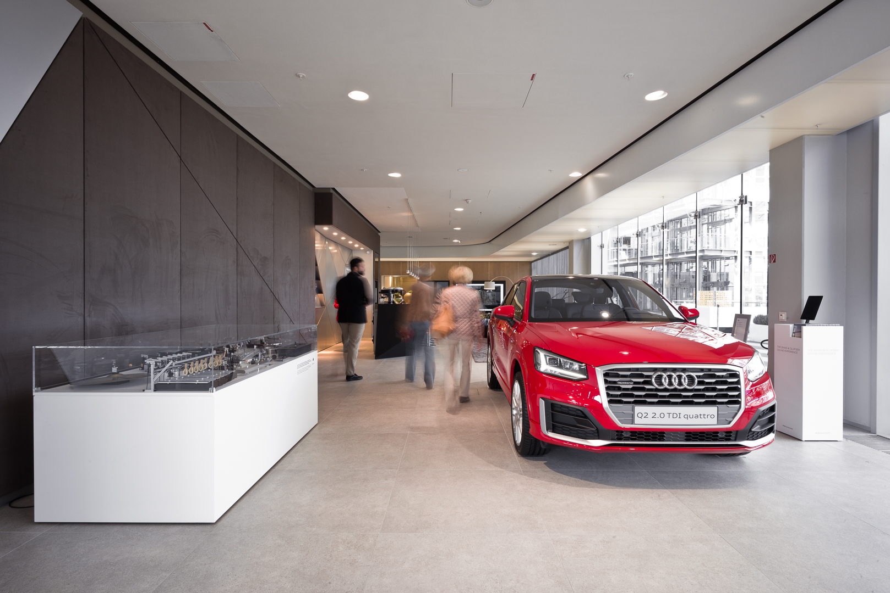

What does Audi sound like?  
And what does Vorsprung durch Technik sound and feel like?  
We’re rethinking both of these questions for Audi. Together with dadamachines, we’ve developed an entirely new instrument for the company: A sound device that creates completely new sounds out of vehicle parts and musical instruments, and combines them to create unique composed tracks. After all, the whole is more than just the sum of its parts.
{: class="copy"}

<iframe src='https://www.youtube.com/embed/bstnULC-JVg' frameborder='0' allowfullscreen></iframe>

{:class="image-content"}

**Role**  
Technical consulting, hardware design and DJing.    

**Credits**    
Design, project management: [BLACKSPACE](https://www.black.space/)   
Sound design: [Christian Heiß](mailto:taison@portmanteau.net)    

**Awards**    
[IF Design Award 2018 - Interior Architecture](https://ifworlddesignguide.com/entry/235025-audi-music-box)  
[Red Dot: Best of the Best - Communication Design 2017](https://www.red-dot.org/about-red-dot/magazine/fair-stands-2017/)

