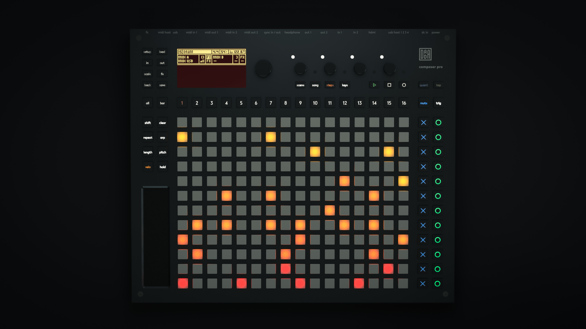
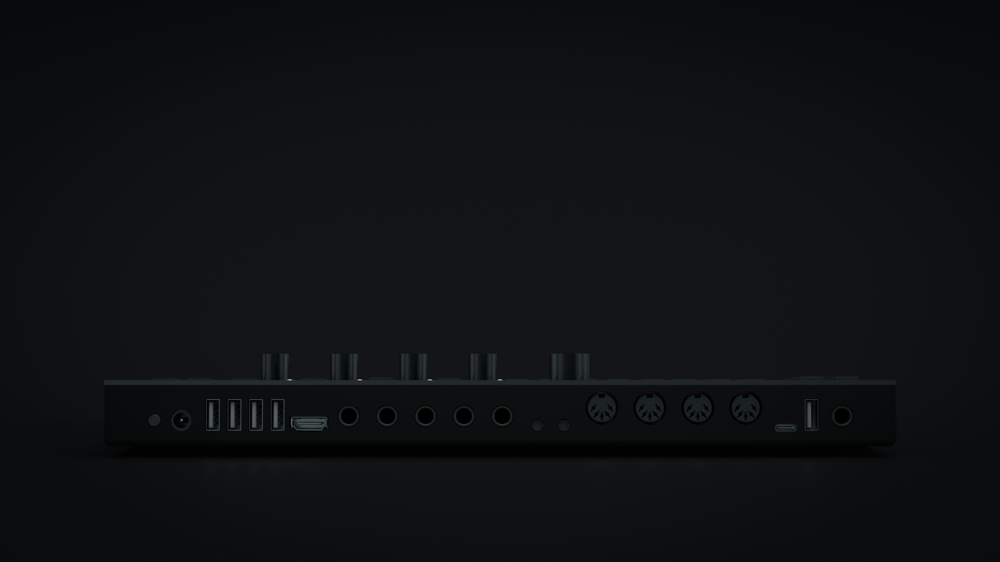

Composer is a Performance Sequencer that can be the ControlCenter of a Live Music Setup or can be included as a Performance Controller Instrument in existing Electronic Music Setups or Simple (MIDI-)Looper in a Studio Jam Session
Composer can store several Songs which consist of up to 16 Machine Slots. There are 12 Pattern Slots per Machine which can be used to Structure a Song.

{:class="img-responsive"}
{:class="img-responsive"}
{:class="img-responsive"}
{:class="img-responsive"}
{: class="image-content mt4"}

**Role**  
Communications & Strategy, Product design, Mechanical engineering and electronics.

**Credits**  
Instrument Concept & Prototype Firmware: [Steffen Sennert](https://www.steffensennert.de/)    
Renderings: [Raoul Wilken](https://booleshit.com/)  

**Selected Press**  
[Create Digital Music](https://cdm.link/2019/05/open-grid-dadamachines-composer-pro/)  
[gearnews.com](https://www.gearnews.com/dadamachines-composer-pro-the-only-performance-sequencer-youll-ever-need/)    
[synthanatomy](http://www.synthanatomy.com/2019/05/dadamachines-announced-composer-pro.html)    
[amazona.de](https://www.amazona.de/superbooth-19-dadamachines-composer-pro-sequencer/)  
