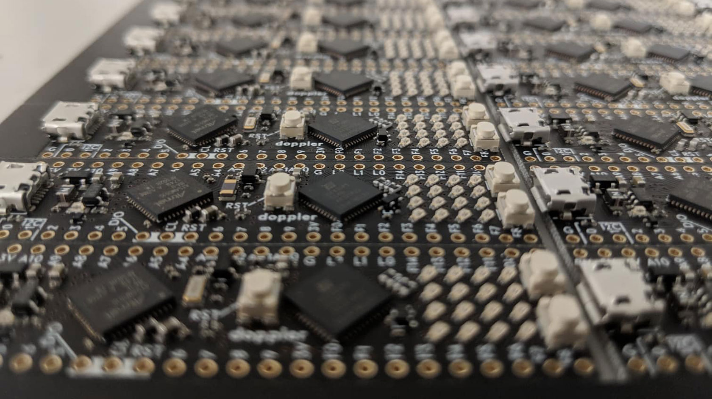

The dadamachines – doppler is a microcontroller + FPGA development board. It comes in the same
tiny form factor similar to a Teensy and is entirely open source.
{: class="copy"}

<iframe src='https://www.youtube.com/embed/c-S2TnZFA0U' frameborder='0' allowfullscreen></iframe>

{: class="image-content"}

We are very excited about FPGA’s but getting started with them is daunting especially because of the ecosystem of proprietary toolchains and expensive hardware. The doppler takes away most of these pains by providing all the tooling to get you up and running.
There are two chips on the board a SAMD51 ARM microcontroller and an
ICE40 FPGA. The microcontroller is easily programmable with, for example, the beginner-friendly Arduino environment. It also needs to be used to upload the configuration as a bitstream to the FPGA.
{: class="copy"}

{: class="image-content"}

**Role**  
Communications, hardware design

**Credits**  
Ideation & Software: [Sven Braun](http://zmors.de){:target="_blank"}     

**Open Source**  
Hardware: [https://github.com/dadamachines/doppler](https://github.com/dadamachines/doppler){:target="_blank"}   
Software: [https://github.com/dadamachines/doppler-software](https://github.com/dadamachines/doppler-software){:target="_blank"}   

**Press**  
[Create Digital Music](http://cdm.link/2019/03/dadamachines-doppler-fpga-open-music-hardware/){:target="_blank"} 