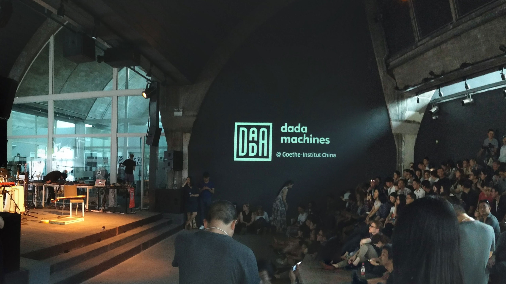

Back in 2017 **Goethe Institute Beijing** invited **dadamachines** to present
their toolkit and radically new approach to the interested public.
{: class="large mb4 max-width-4"}

<iframe src='https://www.youtube.com/embed/MczGVLDbZF8' frameborder='0' allowfullscreen></iframe>

{:class="img-responsive"}

**Role**  
Technical consulting & hardware design    
{: class="large max-width-4"}

**Credits**  
Initiator & ??? [Adam Langer](https://neulantvanexel.de/)  
Curation & coordination in China [Markus M Schneider](http://zmors.de)  
{: class="large max-width-4"}