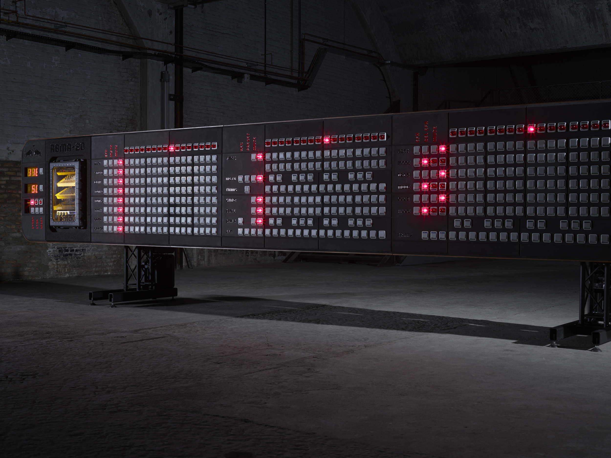

With a length of 10 meters and a height of 2.2 meters, the RBMA-20 is the largest sequencer ever built and it's fully functional. The sequencer features 427 knobs and faders, as well as four analog drummachines, a modular synthesizer and a sampling unit. Designed and built by the Berlin based creative studio NEULANT VAN EXEL, 30 technicians have been working for five weeks to assemble this unique piece of gear.
{: class="intro"}

<iframe src='https://www.youtube.com/embed/siNLuXdJXYw' frameborder='0' allowfullscreen></iframe>

{:class="img-responsive"}
{:class="img-responsive"}
{:class="img-responsive"}
{:class="img-responsive"}
{: class="image-content"}

**Role**  
Technical consulting & hardware design  

**Credits**      
Design, project management: [Neulant van Exel](https://neulantvanexel.de/)  
Firmware development: [Sven Braun](http://zmors.de)  
Custom Sequencer patch: [Servando Barreiro](https://servando.hotglue.me/)  
Music & performance: [Instant](http://instantboner.wtf)  

**Press and additional Information**  
[redbull music academy - blog](https://daily.redbullmusicacademy.com/2018/10/tram-machine-rbma-20)
